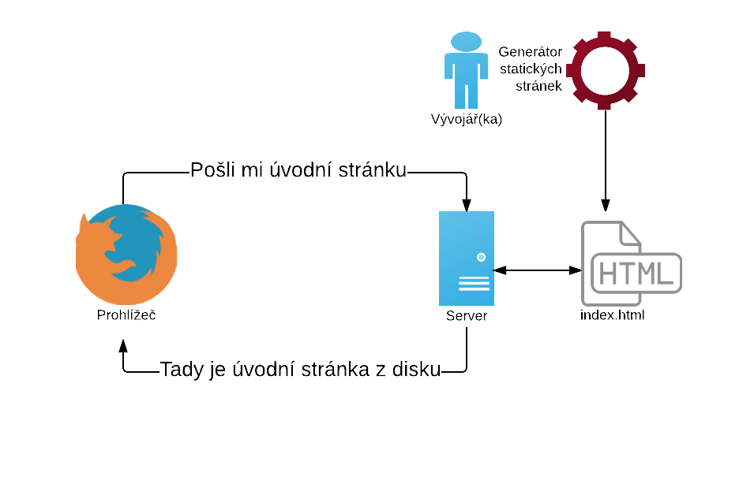
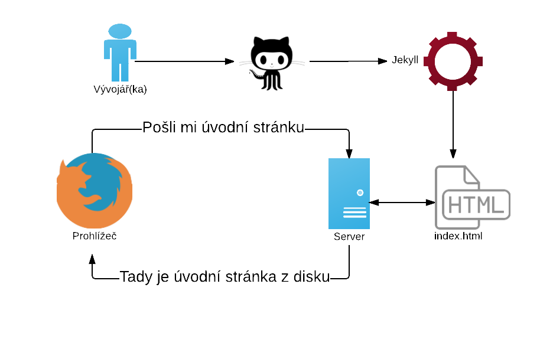

title: Publikujeme a blogujeme na GitHubu
author:
  name: Jan Vlnas
  twitter: janvlnas
  url: https://jan.vlnas.cz
output: prezentace.html
controls: false
style: style.css

---

# Publikujeme a blogujeme na GitHubu

--

### Jak se tvoří web

1. Napiš
2. Zkontroluj
3. Nahraj na server
4. Opakuj

--

### Jenže…

* Ruční nahrávání stránek je otrava
* A ruční udržování více stránek ještě víc

--

<div style="text-align:center">

</div>
--

### Git není jen pro programátory

* [3D modely](https://github.com/lorennorman/octocat-3d/blob/master/stl/octocat_head.stl) (včetně [zobrazení rozdílů](https://github.com/blog/1633-3d-file-diffs))
* [mapy](https://github.com/colemanm/hurricanes/blob/master/fl_2004_hurricanes.geojson)
* [recepty](https://github.com/sinker/tacofancy)
* [vládní data a dokumenty](https://government.github.com/community/)
* psaní a publikování,
* [a více…](http://readwrite.com/2013/11/08/seven-ways-to-use-github-that-arent-coding)

--

### GitHub Pages

<div style="text-align:center">

</div>

--

### Výsledek

…výsledek naleznete na adrese `<username/organizace>.github.io/<název repozitáře>`.

Například: organizace `TvorimWeb-2018-Praha`, repozitář [`projekt7-sluchatka`](https://github.com/TvorimWeb-2018-Praha/projekt7-sluchatka).

Po zapnutí Pages je výsledek na [tvorimweb-2018-praha.github.io/projekt7-sluchatka](https://tvorimweb-2018-praha.github.io/projekt7-sluchatka).

--

### A co takhle vlastní blog?

<div style="text-align:center;padding-top:2em">

</div>

--

### Statické a dynamické stránky

Jaký je rozdíl třeba mezi Jekyllem a WordPressem?

--

## Statické stránky


Soubor se stránkou (např. `index.html`) je uložený na disku serveru. Server jej rovnou pošle prohlížeči.

--

### Dynamické stránky


<div class="note">
Na serveru je aplikace (např. WordPress), která vygeneruje požadovanou stránku „za běhu“ s pomocí šablony a dat uložených v databázi.
</div>

--

### Generátor statických stránek



<div class="note">
U sebe na počítači mám šablony a data, s pomocí generátoru (např. Jekyll) vygeneruji statické stránky a umístím na server. Server posílá statické stránky a neví o žádnem generátoru.
</div>

--

### GitHub Pages



<div class="note">
Při „pushnutí“ změn na GitHub se automaticky vygeneruje web pomocí Jekyllu, a GitHub jej začne servírovat stejně jako statické stránky které jsme si vytvořili předtím.
</div>

--

### Co Jekyll umí?

* Opakované prvky na stránce (např. navigace) můžete dát do šablony,
* automaticky generuje přehled článků a kategorie,
* články umožňuje psát v Markdownu

…a více viz [jekyllrb.com](http://jekyllrb.com/).

--

### Markdown?

…je jednoduchý značkovací jazyk který umožňuje formátovat text jednodušeji než HTML. Například:

```markdown
Tento text je **tučně** a tento _kurzivou_.
Toto je [odkaz na web Czechitas](http://www.czechitas.cz/).
```

vytvoří:

> Tento text je **tučně** a tento _kurzivou_.
> Toto je [odkaz na web Czechitas](http://www.czechitas.cz/).

<small>(Většina této prezentace je psaná v Markdownu)</small>
--

### Zkusme si to

1. „Forkněte“ si ukázkový blog: [tvorimweb-2019-praha-podzim/lekce11](https://github.com/tvorimweb-2019-praha-podzim/lekce11)
2. Zapněte si GitHub Pages v nastavení projektu
3. Upravte text v souboru `o-mne.md` nebo nějaký soubor v adresáři `_posts`
   <br><small>Soubory můžete upravit i přímo na GitHubu, když kliknete na příslušný soubor a vpravo nahoře na ikonu tužky.</small>
4. Podívejte se na výsledek na `<váš username>.github.io/lekce11`!

--

### Zdroje a odkazy

* [Try Git](https://try.github.io/) vás provede podrobně používáním Gitu na příkazové řádce.
* [Markdown Tutorial](http://markdowntutorial.com/) vás provede psaním v Markdownu.
* [Jekyll](http://jekyllrb.com/)
* [GitHub Pages](https://pages.github.com/)

--

### Další generátory statických stránek

* [Hugo](http://gohugo.io/)
* [Docusaurus](https://middlemanapp.com/)
* [GitBook](https://github.com/GitbookIO/gitbook)
* [Docusaurus](https://docusaurus.io/)

--

### Alternativy GitHub Pages

* [GitLab Pages](https://about.gitlab.com/features/pages/)
* [Netlify](https://www.netlify.com/)
